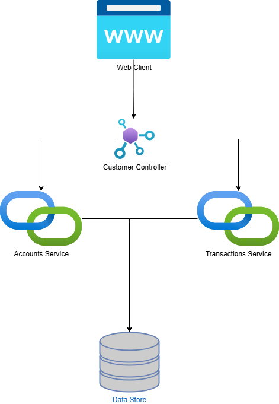

*Account API Project Readme*

*Overview*

This project provides a REST API for managing user accounts and
transactions. It includes endpoints for account creation, retrieving
user details, and handling transactions.

*Explanation:*

[arabic]
. *REST API*: Customer Controller exposes endpoints for creating
accounts and retrieving user information.
. *Account Service*: Handles account creation and retrieving balance.
. *Transaction Service*: Handles transaction creation and fetching
transaction history.
. *Database*: Stores accounts and transactions. This implementation as
the in-memory database. But as a future enhancement, any type of a
database or cloud storage can be used by just introducing an
implementation of BaseRepository interface.
. *Tests and Verification:* Jococo plugin has been used to verify the
test coverage. Currently without 80% of test coverage build won’t
compile.
. *CI/CD* : Github workflow file has been added to the project to
automatically build , test and deploy the application to Dockerhub.
These actions are automatically triggered when pull request is merged to
*dev* or *main* branches.

*Prerequisites*

Ensure you have the following installed:

* Java 17+
* Maven 3+
* Docker

*How to Run Using Maven*

To build and run the project using Maven, use the following commands:

.\mvnw spring-boot:run

*Docker Image Location*

The Docker image for this project is available on DockerHub:

docker pull anujahiniduma/anu:latest

*Running with Docker*

To run the application using Docker:

docker pull anujahiniduma/api-project:latest

*Swagger Documentation*

After starting the application, you can access the Swagger UI at:

http://localhost:8080/swagger-ui.html

*REST API Endpoints*

*Account Management*

* *POST* api/v1/customers/1/accounts - Create a new account
* *GET* /api/v1/customers/\{customerId} - Retrieve user details including

*Spring Boot Actuator Endpoints*

Spring Boot Actuator provides system monitoring endpoints:

* /actuator/health - Application health status
* /actuator/info - Application information
* /actuator/metrics - Performance metrics

*JaCoCo Test Reports*

JaCoCo generates test coverage reports. To generate the reports:

mvn clean verify

Reports will be available in:

target/site/jacoco/index.html

diagram of a customer service,width=449,height=460]
